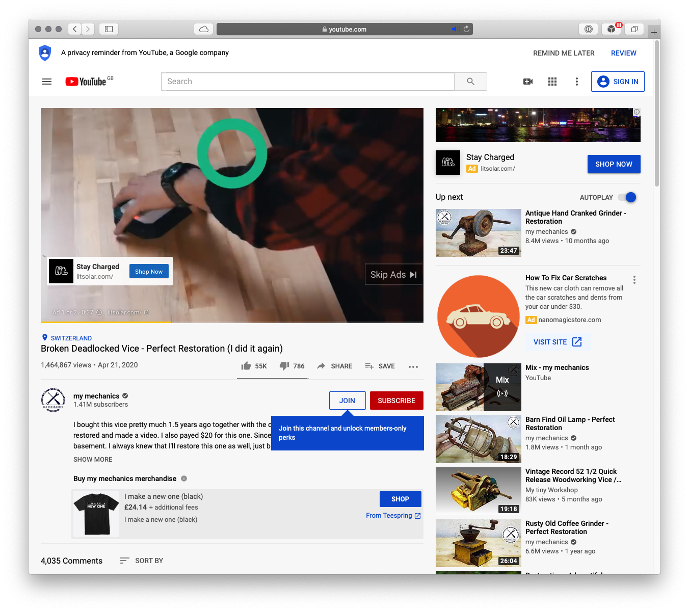
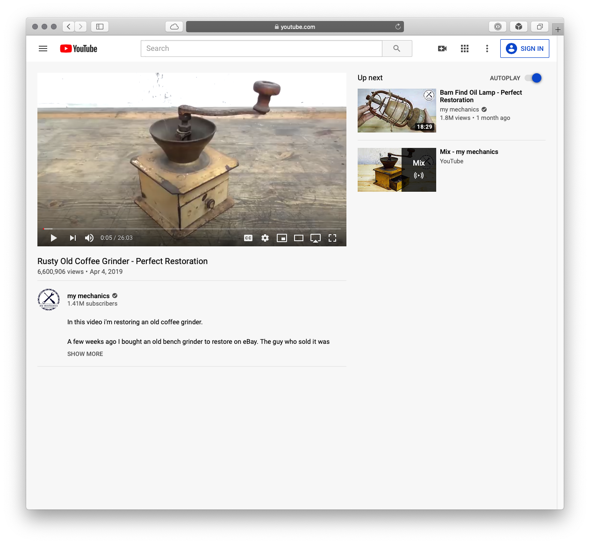

# 1Blocker custom 'hide elements' rules

[1Blocker](https://1blocker.com) is a content blocker that I use for Safari on MacOS and iOS. It has a feature that allows users to create custom rules that hide page elements based on CSS selectors. This repository contains the hide element rules I use to clean up a few popular websites.

To use them, open 1Blocker, click the "Custom" tab, then "CSS Hide Elements." Next, click "+ New Rule," name the rule, and paste in the list of css selectors. Finaly, turn off the option to "hide on all sites" and type in the corresponding root domain for the site.

Here's the before and after effect on YouTube. These combine the regular 1Blocker ad and content blocks as well as the custom rules I've added. Notably, no comments, no watch-next secondary suggestions, no YouTube movie suggestions, no subscribe or join buttons, and no thumb-up/down and share buttons. Just a clean, streamlined interface for watching content with no distractions.

## Before content blocks:

## After content blocks and custom rules:

